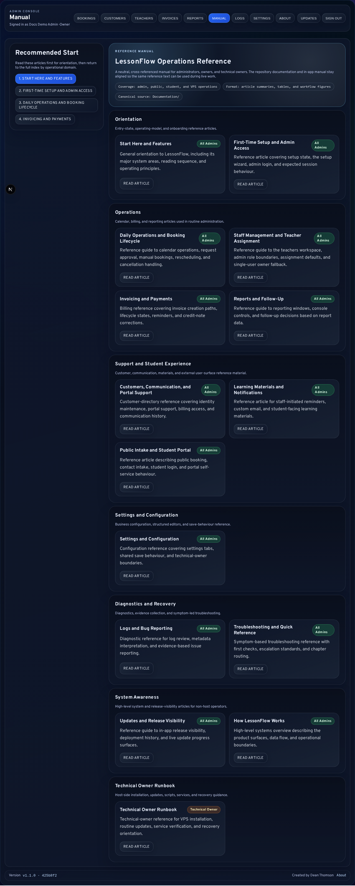

# Start Here and Features

Welcome to LessonFlow. You've found the central hub for managing your music school's operations, from public enquiries to student billing. This chapter gives you a quick map of the whole system so you know where to go when you need to get something done.

<strong>Reference note:</strong> Your in-app manual at <code>/admin/manual</code> renders this documentation for live use inside your admin console. Your Markdown files in <code>Documentation/</code> remain the authored source of truth.

## Overview

You'll find that LessonFlow focuses on connected workflows rather than isolated screens. When you receive a booking request, it often triggers a chain of events: you'll create a customer record, confirm the lesson, grant portal access, and eventually issue an invoice. This manual follows those operational domains, showing you exactly how one task flows into the next.

## Major System Areas

| Area | What you can do | What happens next |
| --- | --- | --- |
| Bookings | Manage your lesson calendar | You'll review requests, confirm appointments, and handle reschedules or cancellations. |
| Staff and Teacher Assignment | Manage your team | You'll set up teacher accounts, assign them to lessons, and manage your own admin identity. |
| Lesson Planning | Structure teaching follow-up | You'll create reusable templates, save booking lesson plans, and expose post-lesson summaries in the student portal. |
| Customers | Maintain student and parent records | You'll update profiles, support portal users, and track communication history. |
| Invoices | Handle your billing lifecycle | You'll draft and send invoices, track payments, and issue credit notes when needed. |
| Reports | Review your business health | You'll use financial summaries to make follow-up decisions and track growth trends. |
| Learning Materials | Share resources with students | You'll upload practice materials and link them directly to specific lessons. |
| Public Intake | Capture new enquiries | You'll receive booking requests and contact forms directly from your website. |
| Student Portal | Provide self-service for students | Your students will log in to view their lessons, request changes, and download materials. |
| Settings | Configure your business | You'll set up your branding, email templates, and default invoice settings. |
| Logs and Issue Reporting | Troubleshoot and report bugs | You'll review system events and escalate technical issues with supporting evidence. |
| Technical Owner Tooling | Maintain your installation | You'll handle updates, backups, and server maintenance tasks. |

## Recommended Reading Sequence

If you're new to LessonFlow, we recommend following this sequence to get up to speed:

1. [First-Time Setup and Admin Access](02-First-Time-Setup-and-Admin-Access.md)
2. [Daily Operations and Booking Lifecycle](03-Daily-Operations-and-Booking-Lifecycle.md)
3. [Staff Management and Teacher Assignment](03a-Staff-Management-and-Teacher-Assignment.md)
4. [Lesson Planning and Templates](03b-Lesson-Planning-and-Templates.md)
5. [Customers, Communication, and Portal Support](04-Customers-Communication-and-Portal-Support.md)
6. [Invoicing and Payments](05-Invoicing-and-Payments.md)
7. [Reports and Follow-Up](07-Reports-and-Follow-Up.md)
8. [Settings and Configuration](08-Settings-and-Configuration.md)
9. [Logs and Bug Reporting](09-Logs-and-Bug-Reporting.md)

You'll start with basic access and daily tasks before moving into more advanced areas like billing, configuration, and system diagnostics.

## Operational Principles

To get the most out of LessonFlow, keep these practical tips in mind as you work:

1. Confirm records before you change them.
2. Archive or edit records instead of deleting them whenever you need to preserve history.
3. Treat communication as a core part of your daily administration.
4. Verify high-impact actions immediately after you save or trigger them.
5. Escalate unexplained behavior through logs instead of relying on guesswork.

## High-Risk Actions

<strong>High-risk actions include:</strong> customer deletion, invoice deletion, credential rotation, system-setting edits, and production deployment commands.

While you have full control over these actions, treat them as deliberate interventions rather than routine tasks. If you're ever unsure about the impact of a destructive change, check the relevant chapter before you click.

## Manual Structure

You can find the in-app manual (shown in the screenshot below) grouped into logical areas like operations, support, and configuration. This structure helps you move from a general understanding of the product to specific workflows while keeping the big picture in view.

## Related Sections

- [First-Time Setup and Admin Access](02-First-Time-Setup-and-Admin-Access.md)
- [Daily Operations and Booking Lifecycle](03-Daily-Operations-and-Booking-Lifecycle.md)
- [Staff Management and Teacher Assignment](03a-Staff-Management-and-Teacher-Assignment.md)
- [Lesson Planning and Templates](03b-Lesson-Planning-and-Templates.md)
- [How LessonFlow Works](12-How-LessonFlow-Works.md)
