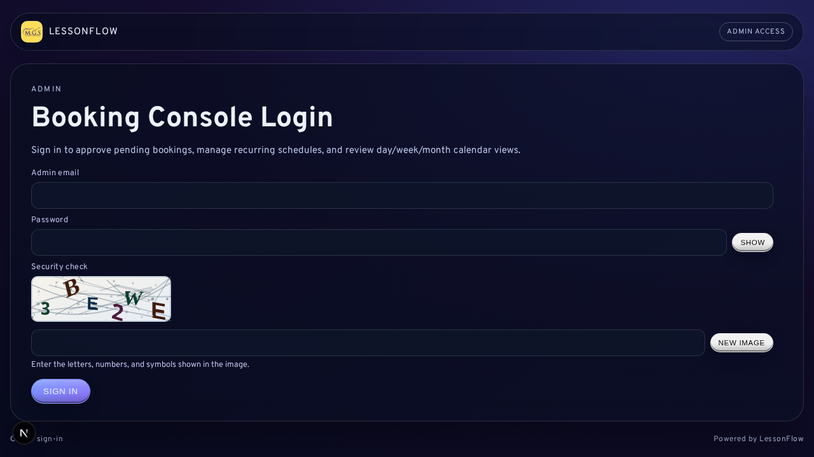

# First-Time Setup and Admin Access

When you first install LessonFlow, you'll encounter one of two entry states: an uninitialized system that requires setup, or an operational system that routes you through the sign-in flow. This chapter guides you through the setup wizard, the standard login pathway, and the session behaviors you'll encounter as an administrator.

<div class="manual-callout warning">
<strong>Audience note:</strong> The setup wizard is ordinarily completed once by an owner or technical owner. Most staff begin their work at <code>/admin/login</code> after the system has already been commissioned.
</div>

## Entry States

LessonFlow distinguishes between these two entry conditions:

| State | Typical route behavior | Intended operator |
| --- | --- | --- |
| Uninitialized system | <code>/admin</code> redirects to <code>/setup</code> | Owner or technical owner |
| Operational system | <code>/admin/login</code> provides the sign-in form | Administrators and owners |

This distinction ensures that staff don't attempt to use a system before you've completed its baseline configuration.

## Setup Wizard

If your setup is incomplete, the Setup Wizard serves as your authoritative path for initialization. You'll use it to confirm your system is ready, save your environment configuration, and create your first administrative account.

In production, you'll find the setup flow is locked behind the <code>SETUP_ACCESS_TOKEN</code> secret. Open <code>/setup?setupToken=...</code> using that value during your first boot so the wizard can communicate with the protected setup APIs.

### Readiness Checks

The readiness interface reports your results as <code>pass</code>, <code>warn</code>, or <code>fail</code>. Use these checks to confirm your environment is viable before you proceed with initialization.

Run these checks to confirm:

- database connectivity
- site URL validity
- presence of required secrets
- general server readiness

Re-run these checks after you make any configuration changes so the wizard reflects your latest environment state.

### Environment Configuration

Use the environment configuration panel if your readiness checks indicate missing or invalid values. This panel allows you to correct your installation settings before you start using the system.

Follow this sequence:

1. Review the failing or warning check.
2. Update the relevant configuration value.
3. Save your configuration.
4. Re-run your checks.
5. Continue only once your installation is in a usable state.

### First Admin Creation

You'll conclude initialization by creating your first admin account. The wizard requires you to enter:

- display name
- email address
- password
- password confirmation

Once you succeed, LessonFlow redirects you to the admin console and marks your setup state as complete.

## Admin Login

Navigate to <code>/admin/login</code> for your normal administrative entry point. Enter the admin email address and password associated with your installation into the login form.

Your administrative sessions are tied to your current credentials. If you change these credentials in Settings, expect to sign in again.


*You'll use the admin login page to access your console.*

## Session and Sign-Out Behavior

You may experience session termination under several normal conditions:

| Cause | Description |
| --- | --- |
| Manual sign-out | You chose to end your session from the admin header |
| Credential rotation | Your password or related authentication material changed |
| Admin identity change | Your configured admin email changed |
| Expiry or restart | Your session ended because of runtime lifecycle behavior |

If you find yourself back at <code>/admin/login</code> unexpectedly, don't assume the system has failed. Sign in again first, and only escalate the issue if the behavior repeats without a clear cause.

## Initial Verification

On your first day of use, perform a basic verification pass across the principal admin areas:

1. Sign in successfully.
2. Open Bookings, Customers, Invoices, Reports, Logs, Manual, and Settings.
3. Confirm your headings, navigation, and page shells render normally.
4. Read the opening chapters of this manual before you make live changes.

```text
Typical first-day path:
/admin/login -> /admin/bookings -> /admin/customers -> /admin/invoices -> /admin/reports
```

## Related Sections

- [Start Here and Features](01-Start-Here-and-Features.md)
- [Settings and Configuration](08-Settings-and-Configuration.md)
- [Logs and Bug Reporting](09-Logs-and-Bug-Reporting.md)
