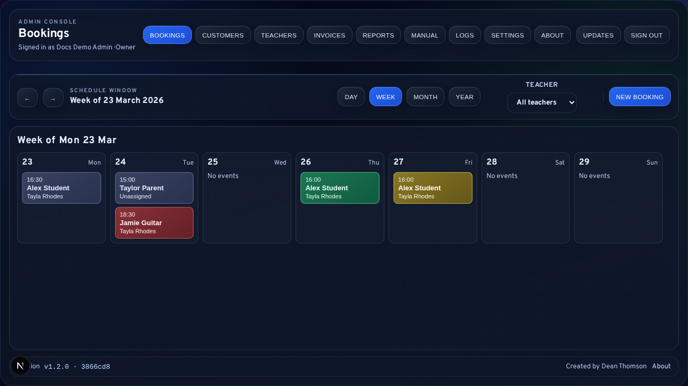
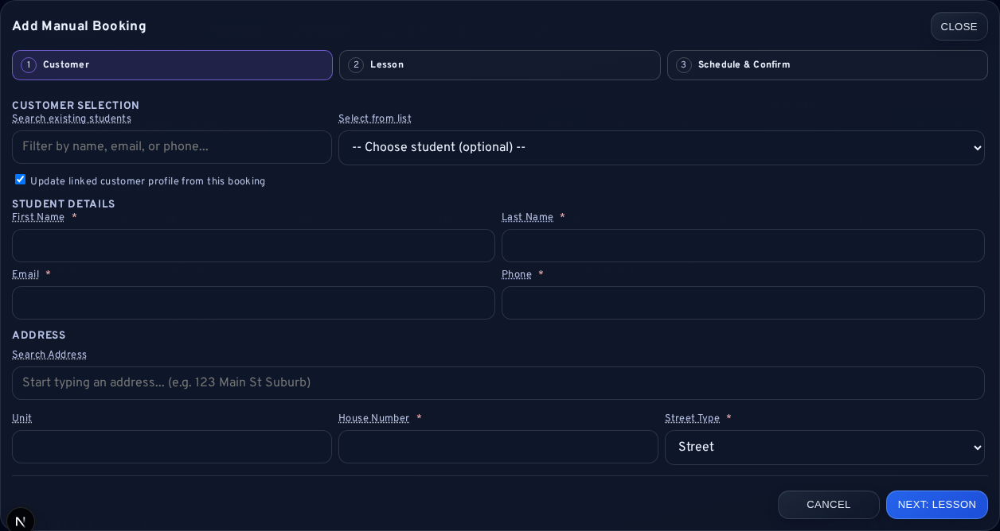
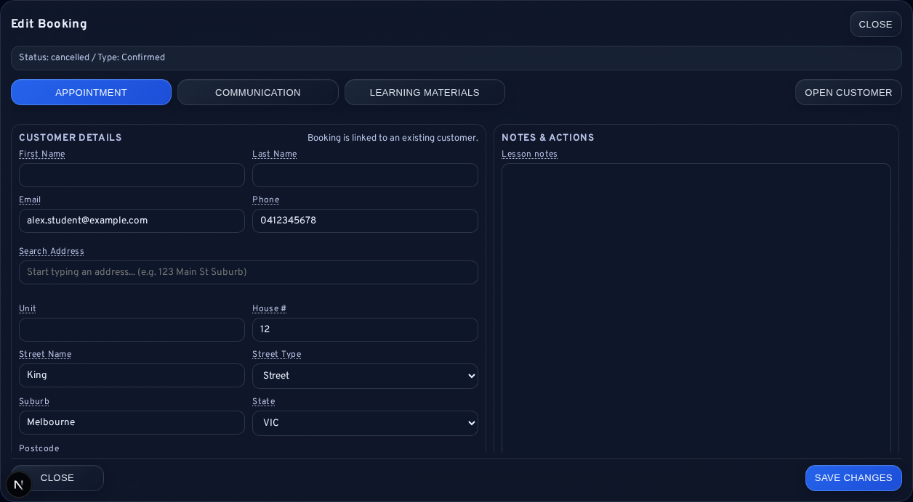
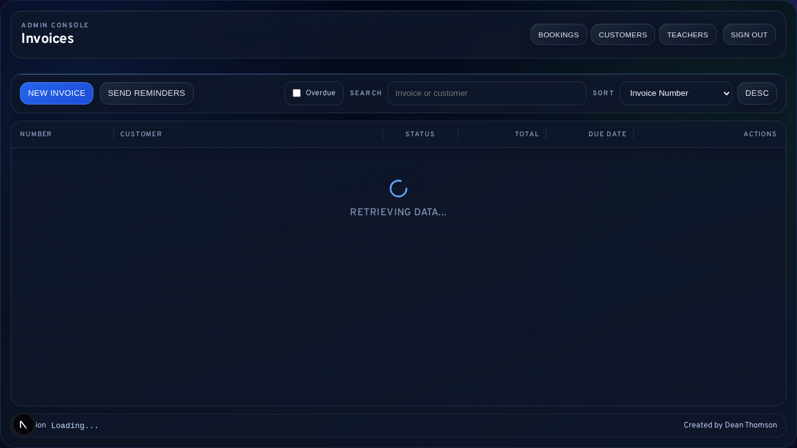

# Daily Operations and Booking Lifecycle

The booking calendar is the principal operational surface of LessonFlow. It combines pending requests, confirmed lessons, cancellations, and historical lesson administration within one workflow, making it the usual starting point for daily work. This chapter describes the lifecycle states visible in the calendar, the interpretation of booking-time controls, and the hand-offs from bookings into customer, communication, and billing workflows.

<strong>Operational note:</strong> For most schools, the Bookings area functions as the daily control room. Billing, customer support, notifications, and materials often begin here even when they conclude elsewhere.

## Daily Operating Pattern

A routine day in LessonFlow commonly follows this sequence:

1. review pending requests and upcoming lessons
2. resolve schedule changes, cancellations, or manual entries
3. hand off customer, invoice, or communication issues to the relevant workflow
4. confirm that urgent follow-up has been recorded

This pattern remains useful because the booking calendar exposes the most time-sensitive work first.

## Calendar Views

The bookings interface provides the following views:

- <code>Day</code>
- <code>Week</code>
- <code>Month</code>
- <code>Year</code>

The week view is generally the most practical for routine administration, while month and year views are more useful for forward planning or broader schedule review.

## Booking States

Pending requests and confirmed bookings share the same calendar surface but represent different stages in the lifecycle.

| Record type | Meaning | Common next actions |
| --- | --- | --- |
| Pending request | A lesson has been requested but not confirmed | Review, approve, reject, remind, or send a custom message |
| Confirmed booking | A scheduled lesson exists in the live calendar | Edit, move, cancel, notify, assign materials, or invoice |
| Cancelled record | Historical evidence of a cancelled request or lesson | Review context only; no longer active work |
| Historical lesson | A past lesson entered for record-keeping or later billing | Confirm timing, notes, teacher assignment, and invoice path |

## Request Approval

Approving a booking request converts intake activity into a live booking workflow. Before approval, the request should be checked for:

- customer identity and contact details
- requested lesson mode
- requested time
- notes or special circumstances
- possible customer matches suggested by the system
- assigned-teacher context where staff ownership matters

<strong>System behaviour:</strong> Request approval can attach the booking to an existing customer record, create a new customer, and ensure that a portal credential exists for the student workflow.

## Manual Booking Creation

Manual bookings are used when the lesson did not originate from the public booking form or when administration is acting on information gathered outside the standard intake route.

The dialog proceeds through four broad stages:

1. customer selection or creation
2. duplicate-match review where applicable
3. lesson detail entry
4. schedule confirmation and save

Where a likely duplicate customer is detected, the operator should deliberately choose between using the existing record, updating that record, or creating a distinct new one. Duplicate creation should be treated as an exceptional choice rather than the default.

Manual booking entry can also be used for already-completed lessons. Historical lessons should be treated as record-correction work rather than as future scheduling. When a historical lesson is entered, the most important follow-up is usually billing, notes, or student-history continuity rather than reminder traffic.

## Teacher Assignment During Booking Work

Teacher assignment is part of normal booking administration rather than background metadata. Pending requests, confirmed bookings, recurring series, and the related customer record can all carry an assigned teacher.

The intended interpretation is:

- owners can choose or change the assigned teacher deliberately
- teachers are scoped to records already assigned to them unless owner-level access is required
- single-user installs treat the owner account as the valid assignable teacher when no separate teacher account exists

This model keeps scheduling, customer ownership, and later billing or support activity aligned around the same responsible staff account.

## Timezone Interpretation

<strong>Time entry rule:</strong> LessonFlow interprets booking time inputs in the configured business timezone rather than in implicit browser or Linux local time.

This means a <code>datetime-local</code> value such as <code>12:00</code> is treated as <code>12:00</code> in the timezone configured through <code>NEXT_PUBLIC_TIMEZONE</code>. The application stores UTC internally, but administrators should reason about lesson times in the business timezone shown by the product.

## Booking Editing and Movement

Confirmed bookings can be edited to update lesson details, customer information, notes, invoice linkage, and address data. Rescheduling is performed through the lesson-move flow and should only be done after the intended replacement time is confirmed.

Before moving a lesson, confirm:

- the correct lesson is open
- the correct week or day is being edited
- the replacement time has been agreed
- the assigned teacher and billing implications still make sense after the move

## Billing From Bookings

Booking records serve as one of the main invoice-entry paths. When billing begins from a booking, LessonFlow can either open an existing linked invoice, show likely invoice matches, or create a new booking-linked draft depending on what already exists for that customer and lesson context.

When a booking needs billing, the operator should confirm:

- whether the booking is already linked to an invoice
- whether a likely existing draft should be reused instead of creating another invoice
- whether lesson pricing has been configured for the intended duration
- whether the booking should remain traceably linked to the invoice

## Cancellation

Cancellation removes the lesson from active scheduling but preserves the historical record. The presence of a cancelled record should therefore be interpreted as retained context rather than a failed deletion.

## Cross-Workflow Actions

Booking records serve as gateways into other administrative domains:

| Booking-side action | Destination workflow |
| --- | --- |
| Manage assigned teacher / staff ownership | [Staff Management and Teacher Assignment](03a-Staff-Management-and-Teacher-Assignment.md) |
| Open Customer | [Customers, Communication, and Portal Support](04-Customers-Communication-and-Portal-Support.md) |
| Invoice / Billing | [Invoicing and Payments](05-Invoicing-and-Payments.md) |
| Reminder or custom email actions | [Learning Materials and Notifications](06-Learning-Materials-and-Notifications.md) |
| Materials actions | [Learning Materials and Notifications](06-Learning-Materials-and-Notifications.md) |

## End-of-Day Review

At the end of a normal operating period, administrators should confirm:

1. urgent pending requests have been reviewed
2. schedule changes and cancellations are reflected correctly
3. lessons that need billing have a clear invoice path
4. required follow-up communication has been sent or recorded

## Related Sections

- [Customers, Communication, and Portal Support](04-Customers-Communication-and-Portal-Support.md)
- [Staff Management and Teacher Assignment](03a-Staff-Management-and-Teacher-Assignment.md)
- [Invoicing and Payments](05-Invoicing-and-Payments.md)
- [Learning Materials and Notifications](06-Learning-Materials-and-Notifications.md)
- [Logs and Bug Reporting](09-Logs-and-Bug-Reporting.md)
