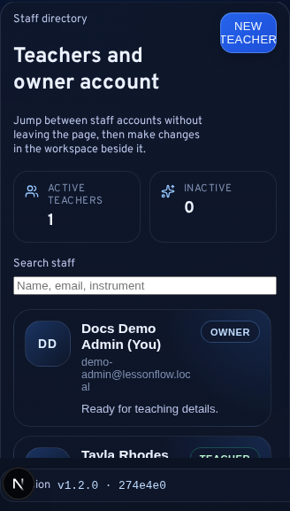
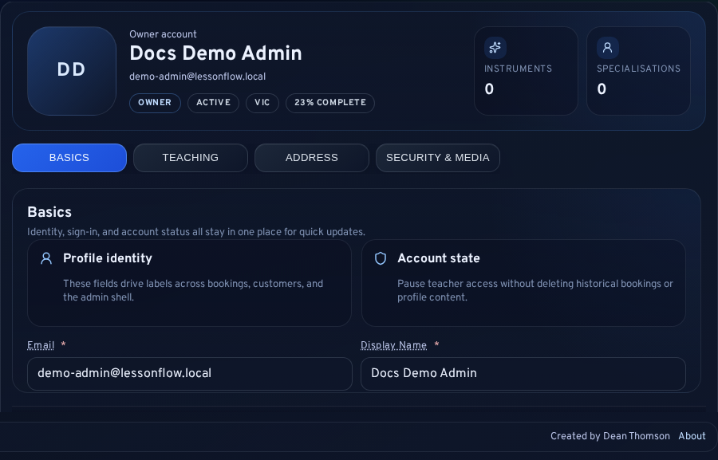
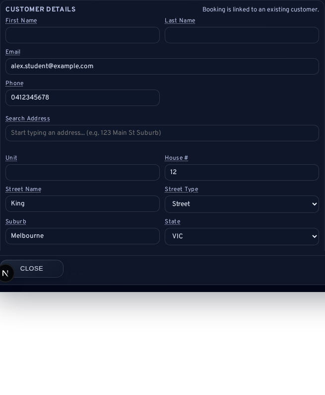

# Staff Management and Teacher Assignment

You use the Teachers area to govern staff identities and assignment rules in LessonFlow. This workspace allows you to manage admin accounts, teaching profiles, and role boundaries without editing database records or relying on hidden assumptions.

<strong>Scope note:</strong> This chapter covers the <code>/admin/teachers</code> workspace, assignment rules used elsewhere in bookings and customers, and the operational meaning of owner-versus-teacher access.

## Workspace Purpose

The teachers workspace uses a directory-plus-editor layout to help you manage your team. You'll find the primary controls for your staff in the main workspace view.

Use this area to:

- Review your owner account details
- Create additional teacher accounts
- Edit teacher profiles and teaching specialisations
- Manage active or inactive staff status
- Upload or remove profile images
- Rotate teacher passwords
- Determine which staff account owns future bookings and customers

Treat this area as a core part of your school’s operating model, rather than just a place for profile maintenance.

## Role Model

LessonFlow distinguishes between two admin roles to help you manage access:

| Role | Typical use |
| --- | --- |
| `owner` | Full operational and configuration authority, including staff management, invoices, reports, settings, logs, and release visibility |
| `teacher` | Teaching-focused admin access with assignment-aware limits on the records they manage |

You and your staff sign in through <code>/admin/login</code>, but the available admin surfaces change based on the assigned role.

## Teachers Workspace Layout

The workspace combines several functional areas to keep your staff management organized:

- **Directory rail**: Switch between staff accounts using the list on the left.
- **Profile header**: Identify the current staff member you are editing.
- **Tabbed editing**: Navigate between <code>Basics</code>, <code>Teaching</code>, <code>Address</code>, and <code>Security &amp; Media</code> to update specific details.
- **Sticky footer**: Save or discard your changes using the persistent actions at the bottom of the screen.

Interpret the sticky footer as the commit point for the active profile. If you see unsaved edits, your current workspace has diverged from the last saved state.

## Creating and Editing Teacher Accounts

Create a teacher account when an instructor needs their own login identity, profile, or assignment ownership. Before you finalize a new account, confirm that:

1. Verify the staff member needs a distinct sign-in
2. Ensure the role remains <code>teacher</code> rather than <code>owner</code>
3. Check that the display name and teaching profile are complete enough for admin use
4. Communicate any password changes securely to the teacher

You can populate teacher profiles with identity fields, address information, instruments, specialisations, background, and musical history. You also have the option to include media like profile imagery.

## Assignment Rules Across The Product

You'll find teacher assignment options in bookings, booking requests, recurring series, and customer profiles.

Follow this model for consistent assignment:

- Assign a booking request during your review or approval process
- Attach a responsible teacher to any confirmed booking
- Preserve the assigned teacher as part of the metadata for a recurring series
- Store a primary teacher in a customer record to set future defaults

These links help you keep scheduling, support, and follow-up aligned to the same staff owner.

## Single-User Install Behaviour

<strong>Single-user rule:</strong> When no active teacher accounts exist, LessonFlow treats the owner account as the valid assignable teacher.

You may see your owner account in assignment dropdowns and booking-edit workflows even though your role remains <code>owner</code>. This is expected behaviour that prevents your school from being forced into a permanently unassigned state if you are the only user.

## Upgrade Behaviour For Older Data

If you have an older installation, you might find bookings, requests, or customer records with no staff assignment because they predate this feature.

LessonFlow can backfill these records automatically only if your install is entirely unassigned and matches specific upgrade conditions. This safeguard prevents the system from rewriting live data where you have already made deliberate assignment choices.

## Operational Checks

After you edit staff or assignment settings, verify that:

1. Confirm your intended staff account appears in the directory
2. Check that the account role and active state are correct
3. Verify your booking and customer assignment dropdowns show the expected staff options
4. Ensure your owner account remains assignable if you have no other active teachers
5. Check that the save footer no longer reports unsaved edits

## Related Sections

- [Daily Operations and Booking Lifecycle](03-Daily-Operations-and-Booking-Lifecycle.md)
- [Customers, Communication, and Portal Support](04-Customers-Communication-and-Portal-Support.md)
- [Settings and Configuration](08-Settings-and-Configuration.md)
- [Technical Owner Runbook: Installation, Updates, and Deploy Scripts](digitalocean-admin-operations.md)
