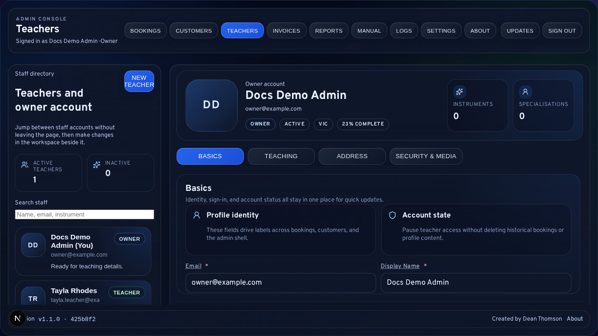

# Staff Management and Teacher Assignment

The Teachers area is the staff-governance surface of LessonFlow. It exists so the owner can manage admin identities, teaching profiles, assignment defaults, and role boundaries without editing database records or relying on hidden assumptions elsewhere in the product.

<strong>Scope note:</strong> This chapter covers the <code>/admin/teachers</code> workspace, assignment rules used elsewhere in bookings and customers, and the operational meaning of owner-versus-teacher access.

## Workspace Purpose

The teachers workspace is designed as a directory-plus-editor layout rather than as a generic settings form. It is used to:

- review the current owner account
- create additional teacher accounts
- edit teacher profile and teaching details
- manage active or inactive status
- upload or remove profile images
- rotate teacher passwords
- understand which staff account should own future bookings and customers

This area should be treated as part of the school’s operating model, not only as profile maintenance.

## Role Model

LessonFlow currently distinguishes between two admin roles:

| Role | Typical use |
| --- | --- |
| `owner` | Full operational and configuration authority, including staff management, invoices, reports, settings, logs, and release visibility |
| `teacher` | Teaching-focused admin access with assignment-aware limits on the records they manage |

All staff still sign in through <code>/admin/login</code>, but the available admin surfaces differ by role.

## Teachers Workspace Layout

The page combines:

- a directory rail for switching between staff accounts
- a profile header showing the current staff identity
- tabbed editing for <code>Basics</code>, <code>Teaching</code>, <code>Address</code>, and <code>Security &amp; Media</code>
- a stable footer area for save and discard actions

The sticky footer should be interpreted as the commit point for the active profile. If unsaved edits are shown, the workspace has diverged from the last saved state.

## Creating and Editing Teacher Accounts

Creating a teacher account is the preferred path when another instructor needs their own login identity, profile, or assignment ownership. The owner should confirm:

1. the staff member needs a distinct sign-in
2. the role should remain <code>teacher</code> rather than <code>owner</code>
3. the display name and teaching profile are complete enough for admin use
4. any password change is communicated securely to the teacher

Teacher profiles support identity fields, address information, instruments, specialisations, background, musical history, and optional media such as profile imagery.

## Assignment Rules Across The Product

Teacher assignment now appears in bookings, booking requests, recurring series, and customer profiles.

The intended model is:

- a booking request may be assigned during review or approval
- a confirmed booking can carry the responsible teacher
- a recurring series preserves the assigned teacher as part of the series metadata
- a customer record can store a primary teacher for later defaults

These links keep later scheduling, support, and follow-up aligned to the same staff owner where possible.

## Single-User Install Behaviour

<strong>Single-user rule:</strong> When no active teacher accounts exist, LessonFlow treats the owner account as the valid assignable teacher.

This means the owner may appear in assignment dropdowns and booking-edit workflows even though the account role remains <code>owner</code>. This is expected and prevents a single-user school from being forced into a permanently unassigned state.

## Upgrade Behaviour For Older Data

Some older installations may contain bookings, booking requests, recurring series, or customer records with no staff assignment at all because they predate the staff-management feature.

LessonFlow can backfill those records automatically only when the install is still entirely unassigned and still matches the guarded upgrade conditions. This safeguard exists to avoid rewriting live data that already contains deliberate assignment choices.

## Operational Checks

After editing staff or assignment settings, the owner should verify:

1. the intended staff account appears in the directory
2. the account role and active state are correct
3. booking and customer assignment dropdowns show the expected staff options
4. single-user installs still expose the owner as assignable when no teachers exist
5. the save footer no longer reports unsaved edits

## Related Sections

- [Daily Operations and Booking Lifecycle](03-Daily-Operations-and-Booking-Lifecycle.md)
- [Customers, Communication, and Portal Support](04-Customers-Communication-and-Portal-Support.md)
- [Settings and Configuration](08-Settings-and-Configuration.md)
- [Technical Owner Runbook: Installation, Updates, and Deploy Scripts](digitalocean-admin-operations.md)
