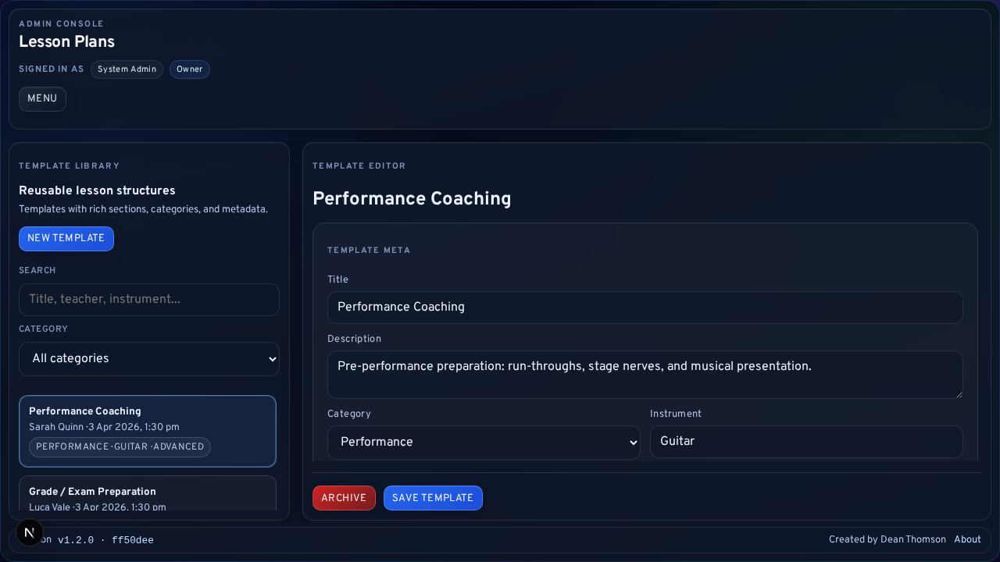
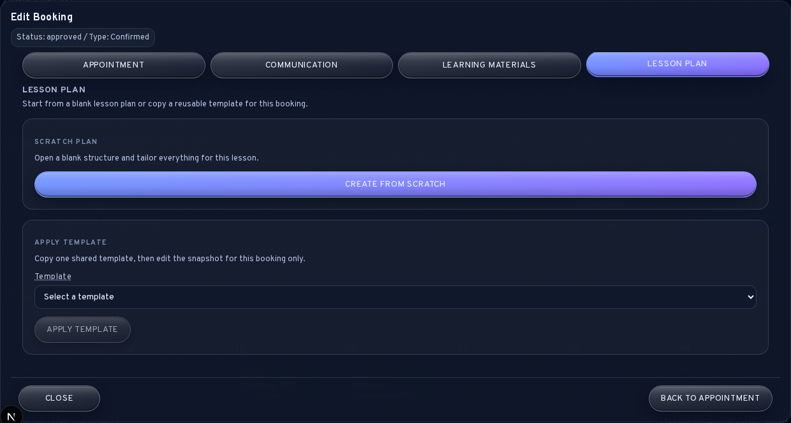

# Lesson Planning and Templates

LessonFlow separates reusable lesson-plan templates from the booking-level lesson plan saved against one specific lesson. This chapter explains how the lesson-plan library works, how a template becomes a booking snapshot, and what parts of that plan later become visible to the student.

<strong>Scope note:</strong> This chapter covers the shared lesson-plan template library at <code>/admin/lesson-plans</code>, the <code>Lesson Plan</code> tab inside a booking, and the post-lesson summary shown in the student portal.

## Workspace Purpose

The lesson-plan library exists so staff can keep commonly reused structures in one place instead of rewriting the same teaching outline for every booking.

The library is intended to answer two different needs:

- create reusable lesson structures for recurring lesson types
- copy one template into a booking and then tailor the snapshot for that one lesson
- preserve historical booking plans even after the underlying template changes

## Template Library Behaviour

The library screen combines:

- a searchable template list
- template ownership metadata
- a structured editor for lesson focus, goals, activities, homework, shared notes, and private notes
- archive controls for templates that should stop appearing in new booking workflows

Templates are not live bindings. When a template is applied to a booking, LessonFlow copies the current field values into the booking record. Future edits to the template do not rewrite already-saved booking lesson plans.

<strong>Operational rule:</strong> Treat templates as starting points, not as centrally linked records. A booking keeps its own lesson-plan snapshot after the template has been applied.

## Ownership And Editing Rules

Lesson-plan templates follow the normal admin-role boundary:

| Staff role | Expected ability |
| --- | --- |
| owner | can create, edit, and archive any template |
| teacher | can create templates and edit or archive templates they created |

This ownership rule applies to the library itself. Booking-level lesson plans use the booking-assignment rule instead: the owner or the assigned teacher manages the plan for that booking.

## Booking Lesson Plans

Inside a booking dialog, the <code>Lesson Plan</code> tab allows staff to either:

1. create a blank lesson plan from scratch
2. select one active template and copy it into the booking
3. edit the copied fields for that lesson
4. save the booking-specific snapshot

The structured booking fields are:

- Lesson Focus
- Goals
- Activities
- Homework
- Shared Notes
- Private Notes

The booking copy is the record that matters for later student visibility. Shared teaching structure should therefore be saved to the booking plan before the lesson concludes if it is intended to appear in the student portal afterwards.

## Student Portal Visibility

Students do not see the full internal lesson-plan record. The student portal only exposes the post-lesson summary fields that are safe to share:

- Lesson Focus
- Goals
- Homework
- Shared Notes

Private Notes and Activities remain admin-only fields. Upcoming lessons also do not expose lesson-plan summaries in the portal. The summary appears only for previous lessons once there is visible content to show.

## Relationship To Materials

Lesson plans and learning materials are complementary but distinct:

| Tool | Intended purpose |
| --- | --- |
| Lesson plan | Structured teaching intent, goals, and post-lesson summary |
| Learning materials | Files, audio, PDFs, and supporting resources delivered to the student |

A lesson can use one without the other. In practice, many staff workflows use the lesson plan to describe what the student should work on and the materials area to attach the actual supporting files.

## Operational Checks

After working with lesson planning, verify that:

1. the correct booking owns the saved lesson plan
2. the template badge matches the intended source, if a template was used
3. template edits have been saved before staff rely on them for new bookings
4. only shareable content has been written into fields that later appear in the student portal
5. the student-facing summary is present only for previous lessons with visible content

## Related Sections

- [Daily Operations and Booking Lifecycle](03-Daily-Operations-and-Booking-Lifecycle.md)
- [Learning Materials and Notifications](06-Learning-Materials-and-Notifications.md)
- [Public Intake and Student Portal](10-Public-Intake-and-Student-Portal.md)
- [Staff Management and Teacher Assignment](03a-Staff-Management-and-Teacher-Assignment.md)
