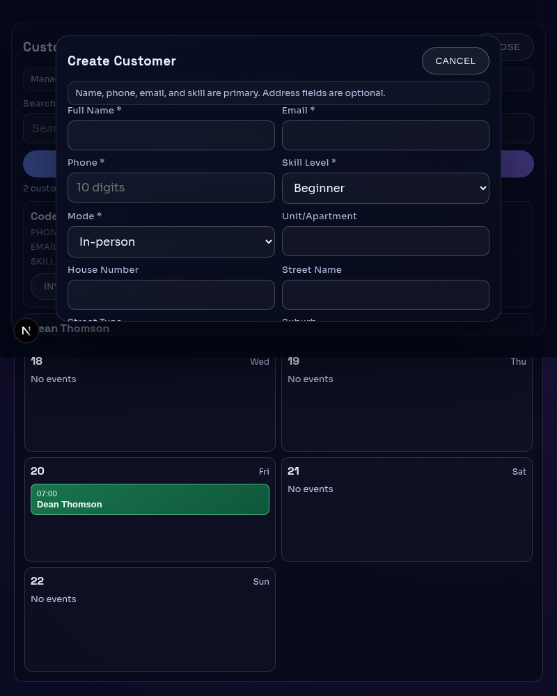

# 04 Customer Directory

## Overview
The customer directory is used to store reusable customer profiles for faster booking and billing operations.

## Before You Start
- Open `/admin/bookings`.
- Click `Customers` in the action row.

## Step-by-Step Instructions

### A) Search Existing Customers
1. Open `Customers`.
2. Use the `Search` field.
3. Review matching customer rows.

### B) Create a New Customer
1. Click `Create New Customer`.
2. Complete the form fields.
3. Click `Save customer`.

### C) Edit Customer Details
1. Find the customer in the list.
2. Click `Edit`.
3. Update relevant details.
4. Click `Save customer`.

### D) Delete/Archive Customer
1. Find the customer row.
2. Click `Delete`.
3. Confirm action.

Important:
- Deleting/archiving is designed to preserve history links where possible.
- Use this only for invalid or duplicate profiles that should no longer be active.

### E) Open Customer Invoice History
1. In the customer row, click `Invoices`.
2. You will be redirected to invoice console filtered by customer.

## Visual Reference

## Expected Result
- You maintain clean customer records.
- Manual booking and invoicing become faster due to reusable customer details.

## Common Mistakes
- Creating duplicate profiles when a profile already exists under slight naming differences.
- Deleting active customers instead of correcting details.

## Troubleshooting
- Customer not found in search:
  - Try email or phone fragments.
  - Check for typo variants in name spelling.
- Duplicate profiles discovered:
  - Keep the most complete profile.
  - Archive/delete incorrect duplicate after verifying history linkage.

## Related Guides
- [03-Booking-Management.md](03-Booking-Management.md)
- [05-Invoice-Management.md](05-Invoice-Management.md)
