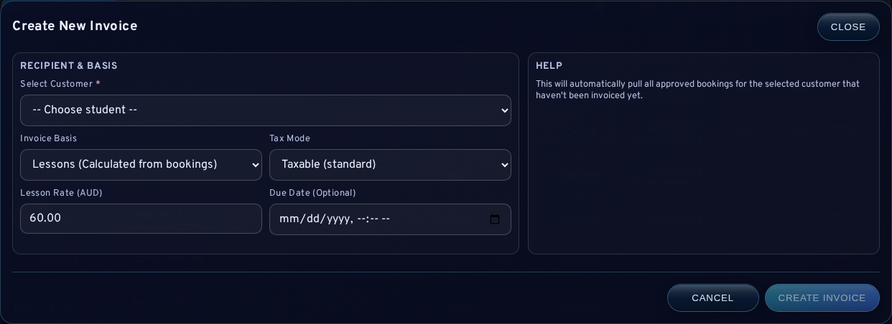
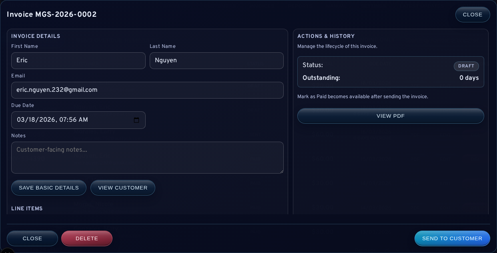

# 05 Invoice Management

## What This Screen Does
The invoice console (`/admin/invoices`) is where you:
- create invoices
- send invoices to customers (email + PDF)
- send overdue reminders
- mark invoices as paid/unpaid
- fix mistakes safely with credit notes

## Before You Start
1. Open `/admin/invoices`.
2. Make sure the customer’s email is correct (see `04-Customer-Directory.md` if needed).

Note:
- Business invoice defaults (ABN, address, bank details, GST policy) should already be configured in `Settings`.

## The Three Invoice States (Simple)
- `Draft`: not yet sent to customer
- `Sent`: customer has been emailed the invoice
- `Paid`: you have received payment and marked it paid

Important:
- Do not delete a sent/paid invoice. Use `Create credit note` for corrections.

## Common Tasks (Step-by-Step)

### A) Create an Invoice (From Invoices Screen)
1. Click `Create Invoice`.
2. Select the customer.
3. Add line items:
   - lesson fee (required)
   - optional extras (books/digital/custom)
   - or use a lesson package preset (dropdown)
4. Set `Due at`.
5. Set `Tax mode`:
   - `Taxable (GST)` or `GST-free`
6. Click `Create invoice`.

### B) Create an Invoice (From a Booking)
1. Go to `/admin/bookings`.
2. Open a confirmed booking.
3. Click `Create invoice`.
4. Fill in pricing and due date.
5. Click `Create invoice`.

### C) Find an Invoice Quickly
1. Use `Search` for invoice number, customer name, or email.
2. Use filters:
   - `Status` (`Draft`, `Sent`, `Paid`, `Void`)
   - `Aging` (`Current`, `Overdue 1-30`, `Overdue 31+`)
   - `Outstanding only` (best for daily follow-up)
3. Click `Refresh` if the list looks stale.

### D) Edit an Invoice
1. Click `View` on the invoice row.
2. Update:
   - `Due At`
   - `Notes`
   - line items (description, quantity, unit price, tax mode)
3. Click `Save`.

Tip:
- If you edit and then download a PDF, the PDF is generated fresh (you should see your changes immediately).

### E) Send the Invoice (Email + PDF)
1. Open the invoice (`View`).
2. Click `Send`.
3. Optional: click `Download PDF` to save/print.

### F) Send Overdue Reminders
For one invoice:
1. Open invoice (`View`).
2. Click `Send reminder` (only available when invoice is overdue and `Sent`).

For bulk reminders:
1. Use `Send Due Reminders` in the invoice toolbar.

### G) Record Payment
1. Open invoice (`View`).
2. Click `Mark paid`.

If marked by mistake:
1. Click `Mark unpaid`.

### H) Fix a Mistake Safely (Credit Notes)
Use a credit note when a sent/paid invoice needs correction.
1. Open the invoice (`View`).
2. Click `Create credit note`.
3. Save and send (if needed).

Do not delete sent/paid invoices.

## Visual Reference

## GST Guidance (Plain English)
- If you charge GST: use `Taxable (GST)`.
- If you do not charge GST for that item: use `GST-free` (it will show GST as `$0.00`).

This guide is operational only and not tax advice.

## Common Beginner Mistakes
- Sending an invoice before checking the due date
- Editing line items but forgetting `Save`
- Trying to delete a sent invoice
  - Fix: use `Create credit note`

## Troubleshooting
- Invoice not visible:
  - clear filters, click `Refresh`
- Reminder button disabled:
  - invoice must be `Sent` and overdue
- PDF looks old:
  - download again; the app forces a fresh PDF download

## Next Guides
- [06-Email-and-Notifications.md](06-Email-and-Notifications.md)
- [07-Reports-Outstanding-and-Follow-Up.md](07-Reports-Outstanding-and-Follow-Up.md)
- [08-Troubleshooting-and-FAQs.md](08-Troubleshooting-and-FAQs.md)
