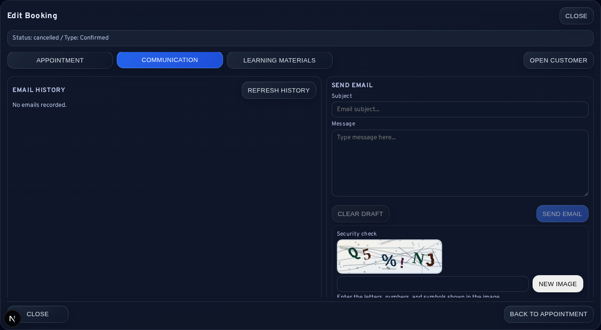
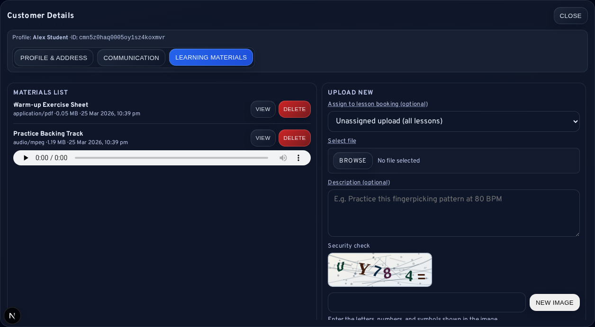
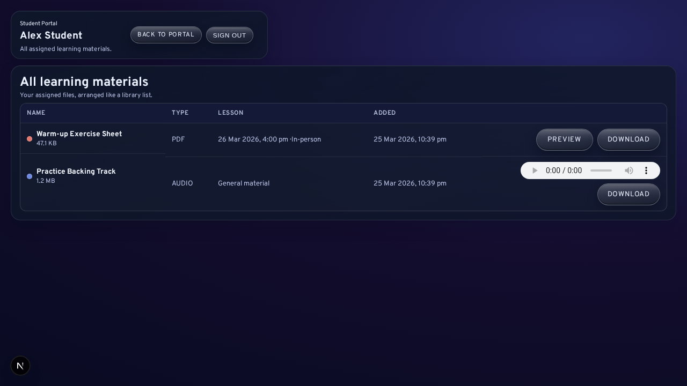

# Learning Materials and Notifications

Learning materials and staff-initiated notifications are the primary student-facing support tools exposed from operational screens in LessonFlow. They allow reminders, custom messages, and practice resources to be handled without leaving the administrative workflow.

<strong>Scope note:</strong> This chapter concerns manual communication and material handling initiated by staff. Automated template editing is documented separately in [Settings and Configuration](08-Settings-and-Configuration.md).

## Notification Types

Booking and request workflows expose two main staff-initiated notification types:

| Notification type | Intended use |
| --- | --- |
| Reminder email | Standard follow-up related to a lesson or request time |
| Custom email | Staff-authored communication for special arrangements or clarification |

Custom email is appropriate where the message cannot be expressed through the standard reminder path.

## Notification Preconditions

Before a manual notification is sent, the following checks should be made:

1. the correct booking or request is open
2. the recipient address is correct
3. the subject and message are clear
4. the CAPTCHA challenge has been completed

These checks reduce the chance of misdirected or incomplete communication.

## Communication History and Sync

Communication history is intended to answer routine support questions such as:

- what was sent
- when it was sent
- whether the item originated in LessonFlow or through provider-backed history refresh
- whether the send succeeded or failed

Where a <code>Refresh History</code> control is available, it may be used to import recent provider-side activity into the visible history.

## Learning Materials

LessonFlow supports learning materials in two broad modes:

| Material mode | Description |
| --- | --- |
| Booking-linked material | A file associated with a specific lesson |
| Unassigned material | A general resource available across the student’s wider practice context |

Supported resources may include PDFs, images, audio files, and other teaching assets accepted by the upload flow.

## Upload and Deletion

The upload workflow typically involves:

1. optional booking selection
2. file selection
3. optional description entry
4. CAPTCHA completion
5. upload confirmation

Deletion is permanent and should only be used when the material should no longer remain visible to the student.

<strong>Deletion note:</strong> Removing a material is not a reversible hide action. It should be treated as permanent removal from the student-facing record.

## Student Experience

Students encounter materials through the portal. Some items appear with a specific past or upcoming lesson, while others appear as general resources unconnected to a single booking.

When a student reports that a file is missing, the following factors should be checked:

- whether the upload completed successfully
- whether the file was linked to the intended booking or left unassigned
- whether the correct student record is being reviewed

## Normal States

The following states can be valid and do not necessarily indicate failure:

- <code>No materials found for this selection</code>
- <code>No materials yet</code>
- a portal view showing only general materials without booking-specific assets

## Related Sections

- [Daily Operations and Booking Lifecycle](03-Daily-Operations-and-Booking-Lifecycle.md)
- [Customers, Communication, and Portal Support](04-Customers-Communication-and-Portal-Support.md)
- [Public Intake and Student Portal](10-Public-Intake-and-Student-Portal.md)
- [Logs and Bug Reporting](09-Logs-and-Bug-Reporting.md)
