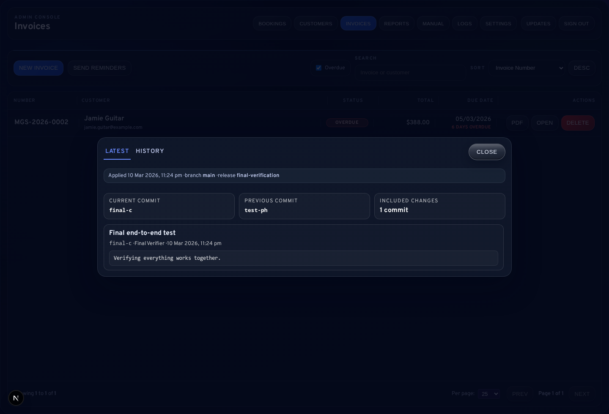

# 07 Reports, Outstanding, and Follow-Up

## What This Guide Helps You Do
This guide helps you keep invoices under control without stress:
- see what is outstanding
- send reminders consistently
- keep notes so someone else can take over if needed

## Where To Work
You will use:
- `/admin/invoices` for the actual follow-up work (filters, reminders, status updates)
- `/admin/reports` for a quick summary view (optional)

## Daily Follow-Up (5–10 Minutes)
1. Open `/admin/invoices`.
2. Turn on `Outstanding only`.
3. Set `Aging` to:
   - `Overdue 1-30` (most common daily work)
4. Open an invoice with `View`.
5. If appropriate, click `Send reminder`.
6. Add a short note if there is a special situation (optional).

## Weekly Follow-Up (15–30 Minutes)
1. Open `/admin/invoices`.
2. Click `Send Due Reminders` (bulk send).
3. Re-check the list:
   - focus on older overdue invoices (`Overdue 31+`)
4. For complex cases, add notes so the next person understands what happened.

## Monthly / Yearly
Use `/admin/reports` to review:
- earnings and trends
- outstanding invoice totals
- comparison vs previous month/year

If you want to export totals for accounting, coordinate with the owner/technical admin.

## Visual Reference

## Reminder Timing (Simple)
The app supports a staged cadence (7/14/30 days overdue) for automated runs.

Manual reminders can still be sent for any overdue invoice when needed.

## Common Beginner Mistakes
- Sending reminders for invoices that were never `Sent`
  - Fix: open invoice and click `Send` first
- Forgetting to mark paid
  - Fix: open invoice and click `Mark paid`
- Trying to delete a sent invoice
  - Fix: use a credit note instead

## Troubleshooting
- Bulk reminders send fewer than expected:
  - only invoices that are `Sent` and overdue are eligible
- List looks wrong:
  - clear filters and click `Refresh`

## Technical Owner Note (Scheduler)
On a droplet, automatic jobs run only if the scheduler is installed (cron/systemd timer).
Deploy scripts can manage crontab entries, but the cron service must be running.

## Next Guides
- [05-Invoice-Management.md](05-Invoice-Management.md)
- [06-Email-and-Notifications.md](06-Email-and-Notifications.md)
- [08-Troubleshooting-and-FAQs.md](08-Troubleshooting-and-FAQs.md)
