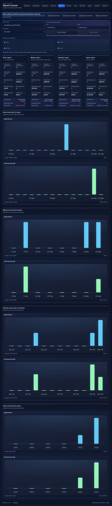
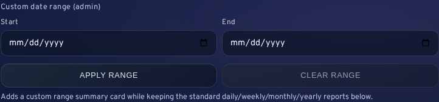

# Reports and Follow-Up

The reports area translates LessonFlow activity into administrative summaries that can guide collection, scheduling review, and owner oversight. Rather than serving as a passive statistics page, it functions as a decision-support surface for outstanding billing, cancellations, and net paid earnings.

<strong>Interpretation note:</strong> Reports are most useful when they lead to action. Their value lies in identifying what requires follow-up, not merely in displaying totals.

## Available Report Windows

LessonFlow provides the following reporting windows:

- daily
- weekly
- monthly
- yearly
- custom range

Each window may combine appointment activity, cancellations, overdue values, outstanding totals, and paid earnings.

## Console Controls

The reports console includes controls for refresh, report-email dispatch, chart presentation, date formatting, and optional custom-range application.

| Control group | Typical use |
| --- | --- |
| Refresh | Reload current report data |
| Report email actions | Send a prepared summary to an owner or stakeholder |
| Chart and date controls | Adjust trend visualisation and label formatting for review |
| Custom-range inputs | Investigate a non-standard period |

## Custom Range

Custom range reporting is intended for questions not answered by the default time windows, such as school-holiday periods, short promotional windows, or a specific overdue follow-up interval.

Both dates are required, and the start date must not be later than the end date.

## Trend Charts

Trend panels are intended to show change over time rather than to replace the fixed period summary cards. The chart-style control can switch between bar, line, area, step, and lollipop presentation. This changes the visual treatment only; the underlying report totals do not change.

Step and lollipop views are particularly useful when the operator wants to emphasise discrete period changes rather than a smoothed visual trend.

## High-Value Metrics

The following metrics are typically the most operationally useful:

| Metric area | Why it matters |
| --- | --- |
| Outstanding invoices | Indicates the current unpaid balance still in circulation |
| Overdue totals and counts | Identifies where collection urgency is increasing |
| Cancelled appointments | Reveals schedule instability or policy pressure |
| Net paid earnings | Reflects money collected rather than merely billed |

## Routine Follow-Up

A common follow-up sequence is:

1. review outstanding and overdue values
2. identify invoices that require action
3. move into the invoices workflow where necessary
4. send report emails only when a stakeholder needs the summary without signing in

## Related Sections

- [Invoicing and Payments](05-Invoicing-and-Payments.md)
- [Logs and Bug Reporting](09-Logs-and-Bug-Reporting.md)
- [Updates and Release Visibility](11-Updates-and-Release-Visibility.md)
