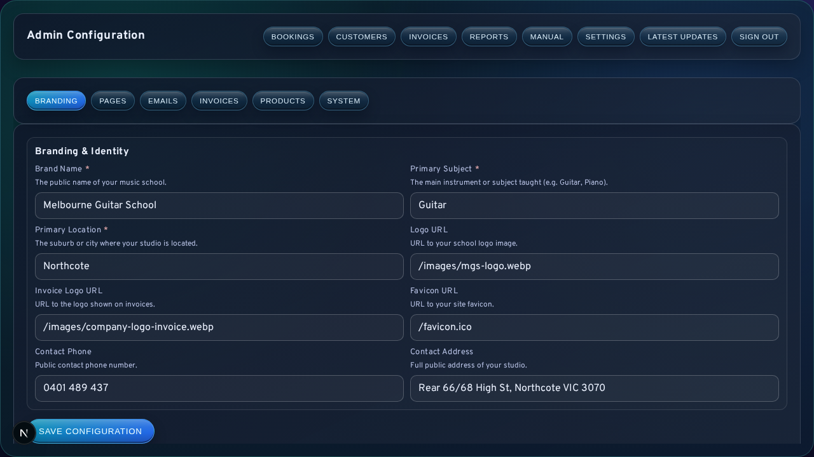

# Settings and Configuration

The Settings area centralises branding, public content, email templates, invoice defaults, product presets, and system-level configuration. It is one of the most consequential parts of LessonFlow because several changes affect login state, delivery configuration, or runtime behaviour beyond the screen itself.

<div class="manual-callout warning">
<strong>High-impact area:</strong> Some settings saves can queue a service restart or force administrative re-authentication. Configuration changes should therefore be made deliberately and verified immediately afterward.
</div>



## Shared Behaviour

Several rules apply across the Settings area regardless of tab:

1. <code>Save Configuration</code> applies the environment-backed values currently shown on the page.
2. Secret inputs may appear blank even when a stored value already exists.
3. Leaving a masked secret blank preserves the existing saved value.
4. Validation errors are returned at field level.
5. Some saves trigger a systemd restart or sign-out requirement.

These behaviours are normal and should be interpreted as part of the configuration model rather than as failures.

## Branding Tab

The Branding tab defines the public identity of the school or studio.

| Field | Operational meaning |
| --- | --- |
| `NEXT_PUBLIC_BRAND_NAME` | Public business or studio name |
| `NEXT_PUBLIC_PRIMARY_SUBJECT` | Main instrument or subject taught |
| `NEXT_PUBLIC_PRIMARY_LOCATION` | Public-facing location reference |
| `NEXT_PUBLIC_LOGO_URL` | Main logo |
| `NEXT_PUBLIC_INVOICE_LOGO_URL` | Logo used in invoice presentation |
| `NEXT_PUBLIC_FAVICON_URL` | Site favicon |
| `NEXT_PUBLIC_CONTACT_PHONE` | Public phone contact |
| `NEXT_PUBLIC_CONTACT_ADDRESS` | Public address display |

This tab is generally used during rebranding, contact-detail correction, or visual identity alignment.

## Pages Tab

The Pages tab is a structured content editor rather than a freeform page builder. It stores content in keyed blocks that are associated with a route and section identifier.

Each block includes:

- page path
- section key
- section content represented as JSON

The editor should be used only when the operator is comfortable editing structured content, because invalid JSON prevents a successful save.

## Emails Tab

The Emails tab controls the wording of automated email templates. Each template includes a subject field and an HTML body field.

Placeholder tokens required for dynamic content should be preserved unless the technical meaning of the template is fully understood.

## Invoices Tab

The Invoices tab defines both billing defaults and invoice presentation content.

### Invoice and Payment Defaults

| Field | Operational meaning |
| --- | --- |
| `INVOICE_BUSINESS_NAME` | Business name shown on invoices |
| `INVOICE_BUSINESS_ABN` | Optional ABN display |
| `INVOICE_BANK_NAME` | Bank name in payment instructions |
| `INVOICE_BANK_BSB` | BSB shown to customers |
| `INVOICE_BANK_ACCOUNT_NAME` | Account name for payment |
| `INVOICE_BANK_ACCOUNT_NUMBER` | Account number for payment |
| `INVOICE_PAYMENT_TERMS_DAYS` | Default due period |
| `INVOICE_GST_REGISTERED` | GST registration state |
| `INVOICE_DEFAULT_TAX_MODE` | Default tax calculation mode |
| `INVOICE_CREDIT_NOTE_PREFIX` | Credit-note identifier prefix |
| `NEXT_PUBLIC_DEFAULT_CURRENCY` | Default currency code |

### Invoice Content and Terms

The invoice content editor includes branding, header information, and footer terms. It is used when invoice appearance, payment instructions, or policy wording changes.

## Products Tab

The Products tab stores reusable billing presets. Each preset typically contains:

- label
- price
- default description

Presets are intended to make common invoice creation faster and more consistent across repeated products or lesson packages.

## System Tab

<div class="manual-callout warning">
<strong>Technical-owner zone:</strong> The System tab contains configuration for infrastructure, delivery, session security, and administrative identity. Changes here should be limited to operators who understand the downstream effect.
</div>

### Core System

| Field | Operational meaning |
| --- | --- |
| `DATABASE_URL` | Database connection target |
| `NEXT_PUBLIC_SITE_URL` | Public site URL |
| `ADMIN_EMAIL` | Admin login and notification address |

### Email Delivery

The System tab supports both Gmail API and SMTP delivery paths.

| Field | Operational meaning |
| --- | --- |
| `GMAIL_CLIENT_ID` | Gmail API client identifier |
| `GMAIL_CLIENT_SECRET` | Gmail API client secret |
| `GMAIL_REFRESH_TOKEN` | Gmail refresh token |
| `GMAIL_USER_EMAIL` | Gmail sender address |
| `SMTP_HOST` | SMTP host |
| `SMTP_PORT` | SMTP port |
| `SMTP_USER` | SMTP username |
| `SMTP_PASS` | SMTP password |
| `SMTP_FROM` | Sender display and address |

This area also includes the Gmail API status card, which is used to review connection state and authorised sender information.

### Security and Portal Access

| Field | Operational meaning |
| --- | --- |
| `ADMIN_SESSION_SECRET` | Admin session signing secret |
| `STUDENT_SESSION_SECRET` | Student session signing secret |
| `STUDENT_PORTAL_PASSWORD_ENCRYPTION_KEY` | Encryption for stored student credentials |
| `CRON_SECRET` | Protection for scheduled job endpoints |
| `STUDENT_SESSION_MAX_AGE_SECONDS` | Student session duration |
| `STUDENT_PORTAL_PASSWORD_LENGTH` | Generated portal password length |

### Admin Password Rotation

The password-management card is used when the administrative password must be replaced. Re-authentication after rotation is expected.

## Tab Selection Guide

| Tab | Use it when |
| --- | --- |
| Branding | Public identity or contact details change |
| Pages | Structured site content needs revision |
| Emails | Automated email wording needs revision |
| Invoices | Billing defaults or invoice presentation changes |
| Products | Reusable billing presets need maintenance |
| System | Infrastructure, secrets, delivery, or admin credentials change |

## Verification After Save

After saving settings, administrators should:

1. read the response message in full
2. confirm whether restart or sign-in was expected
3. revisit the affected workflow
4. escalate if a save error references secrets, database access, restart failure, or delivery breakage

```text
Typical save outcomes:
- "Settings saved."
- "Settings saved. Restarting the systemd service now."
- "Settings saved. Identity changed, please sign in again."
```

## Related Sections

- [First-Time Setup and Admin Access](02-First-Time-Setup-and-Admin-Access.md)
- [Logs and Bug Reporting](09-Logs-and-Bug-Reporting.md)
- [Technical Owner Runbook: Installation, Updates, and Deploy Scripts](digitalocean-admin-operations.md)
