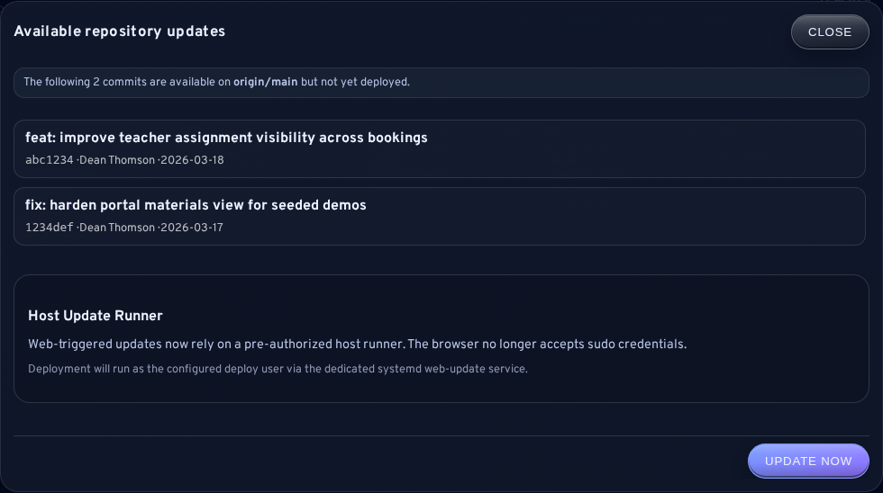
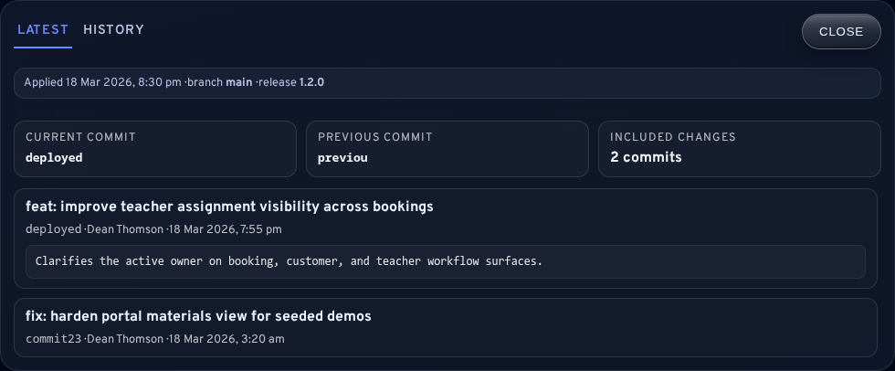
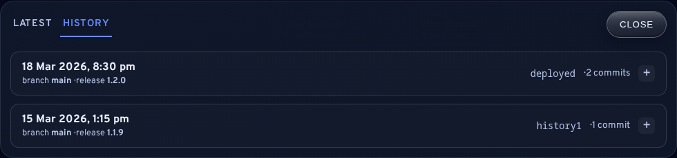
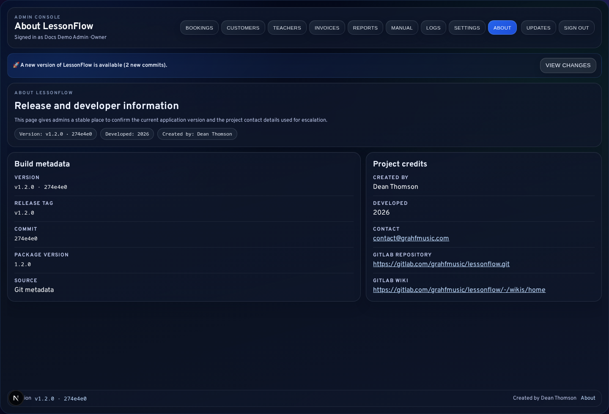
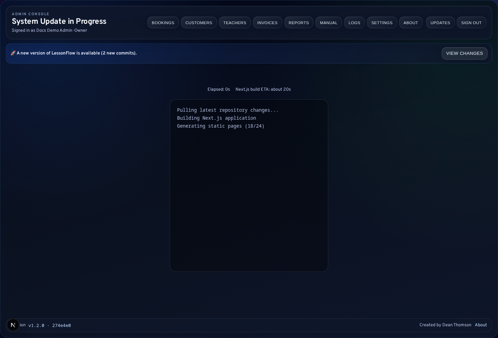

# Updates and Release Visibility

LessonFlow exposes release information inside the admin console so administrators and owners can understand what has changed without relying on informal memory or off-platform communication. This chapter describes the admin-facing release surfaces and their role in confirming deployment state.

<strong>Boundary note:</strong> This chapter documents visibility into deployed and pending changes. The server-side installation and update procedure is documented separately in the technical-owner runbook.

## Update Notification Banner

When LessonFlow detects pending commits for the deployed installation, an update banner may appear in the admin experience. The banner is intended to indicate that a change exists, not that the change has already been applied.

The banner may show:

- that a new version is available
- how many commits are pending
- a <code>View Changes</code> action

## Pending Changes Modal

The pending-changes modal exists to explain what is waiting to be deployed. It helps administrators determine whether an owner or technical owner should take action and provides commit-level context before expectations are set with staff or customers.

## Deployment Updates Dialog

The admin header exposes an <code>Updates</code> button that opens the deployment updates dialog. This dialog is chiefly useful after an update has already run.

### Latest Tab

The Latest tab commonly displays:

- applied date and time
- branch
- release tag or label
- current commit
- previous commit
- included commits

This tab is the primary in-app source for confirming what code is currently live.

### History Tab

The History tab provides earlier deployment records and is used to answer questions such as:

- when a change was deployed
- whether a fix has already reached production
- whether a newly observed issue aligns with a recent release

## Version References

Release identity also appears in:

- the compact version footer across admin screens
- the <code>/admin/about</code> page

These locations are useful when a support report needs version context but the full updates dialog is unnecessary.

This release context matters more once workflow behavior is tied to versioned rules such as teacher assignment fallback or timezone-safe booking handling. When administrators report unexpected scheduling behavior, the current version should be confirmed before the issue is escalated as a product defect.

## Live Update Progress

Where web-triggered updates are enabled, LessonFlow can display a live update progress page with streamed output and status changes such as connecting, updating, restarting, complete, or error.

<strong>Operational caution:</strong> During an active update, the progress page should remain open unless the technical owner instructs otherwise.

## Administrative Roles

| Reader type | Appropriate use of these screens |
| --- | --- |
| Normal admin | Confirm whether a change exists, determine current version, include release context in escalations |
| Technical owner | Correlate deployment timing with behaviour, confirm applied commit history, review web-triggered update progress |

## Related Sections

- [Logs and Bug Reporting](09-Logs-and-Bug-Reporting.md)
- [Technical Owner Runbook: Installation, Updates, and Deploy Scripts](digitalocean-admin-operations.md)
- [Troubleshooting and Quick Reference](13-Troubleshooting-and-Quick-Reference.md)
