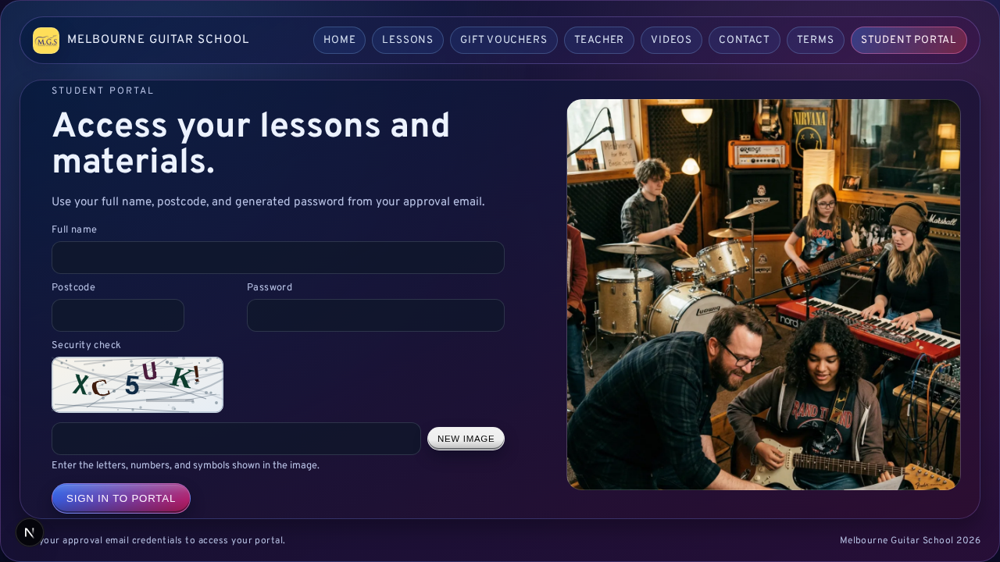

# 12 Student Portal and Learning Materials

## What This Is
The student portal is the student-facing area of the website.

Students can:
- log in with their portal password
- see upcoming and previous appointments
- preview or download learning materials (PDF/audio)
- view general learning materials (not linked to a specific appointment)

Admins can:
- help students log in (reveal/regenerate password)
- upload learning materials

## What You Need (Admin)
- The student must exist in the customer directory.
- The student must have at least one approved booking (for portal access to make sense).
- You need to know how to securely share a password (avoid public channels).

## Student Login (What To Tell Them)
1. Go to `/student/login`.
2. Enter:
   - full name
   - postcode
   - portal password
3. After sign-in, they land on `/student/portal`.

## If a Student Can’t Log In (Admin Steps)
1. Open `/admin/bookings`.
2. Click `Customers`.
3. Find the student.
4. Use:
   - `Reveal password` (read the current password), or
   - `Regenerate password` (make a new one)
5. Share the password securely with the student.

Important:
- If you regenerate, the old password stops working immediately.

## Upload Learning Materials (Admin)
1. Open `/admin/bookings`.
2. Open `Customer Learning Materials`.
3. Select a customer.
4. Upload a file.
5. Optional: link it to an appointment.
6. Save.

You can also upload “general” materials not linked to any appointment.

## Preview vs Download (What Students See)
- PDFs usually preview inside the browser.
- Audio usually plays in the browser.
- If preview does not work (browser limitation), use `Download`.

## Visual Reference

## Common Beginner Mistakes
- Uploading materials to the wrong customer
  - Fix: double-check the selected customer name
- Regenerating passwords without warning the student
  - Fix: tell them the old password will stop working

## Troubleshooting
- Student cannot log in:
  - confirm the full name/postcode match the customer record
  - reveal/regenerate password
- Upload fails:
  - file may be too large

## Next Guides
- [03-Booking-Management.md](03-Booking-Management.md)
- [06-Email-and-Notifications.md](06-Email-and-Notifications.md)
