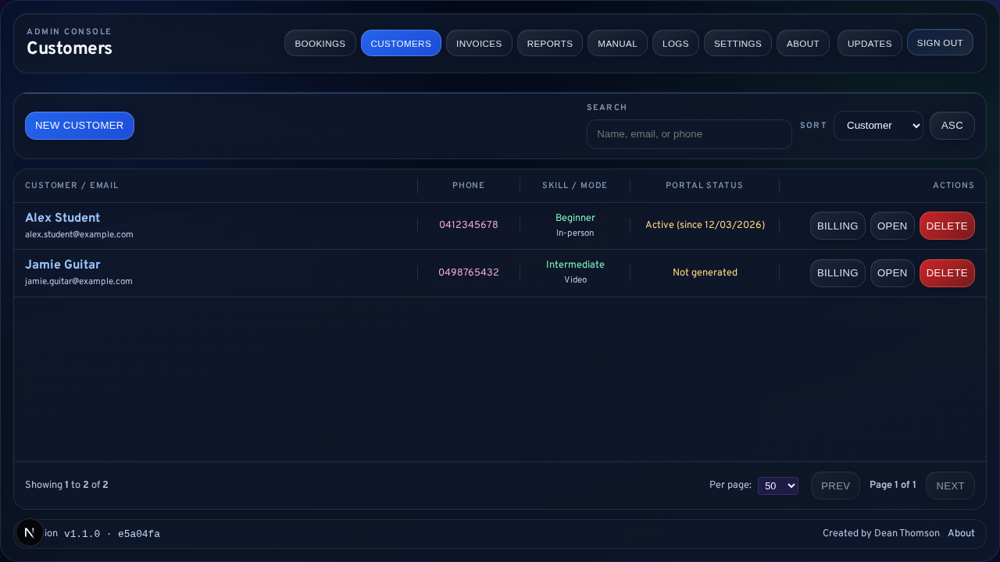
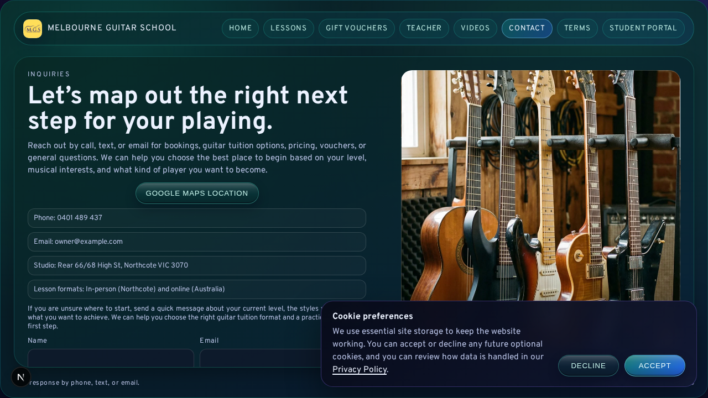

# End-User Documentation

This documentation is for people who operate Melbourne Guitar School day-to-day.

If you are an admin user, this set teaches you how to:
- manage bookings,
- manage customers,
- create and send invoices,
- follow up overdue invoices,
- handle common issues safely.

## Who This Is For
- Owner/admin operators.
- Front-desk/operations support.
- Backup team members covering bookings and billing.

## Start Here
1. `01-Getting-Started.md`
2. `02-Admin-Login-and-Access.md`
3. `03-Booking-Management.md`
4. `04-Customer-Directory.md`
5. `05-Invoice-Management.md`

## Full Guide Index
- [01-Getting-Started.md](01-Getting-Started.md): Platform orientation and first-use path.
- [02-Admin-Login-and-Access.md](02-Admin-Login-and-Access.md): Admin sign-in, sign-out, and access issue recovery.
- [03-Booking-Management.md](03-Booking-Management.md): Calendar workflows, booking updates, and booking-side invoice start.
- [04-Customer-Directory.md](04-Customer-Directory.md): Customer create/edit/search and invoice-history navigation.
- [05-Invoice-Management.md](05-Invoice-Management.md): Full invoice lifecycle from create to paid/credit note.
- [06-Email-and-Notifications.md](06-Email-and-Notifications.md): Manual and scheduled communications, plus SMTP fallback behavior.
- [07-Reports-Outstanding-and-Follow-Up.md](07-Reports-Outstanding-and-Follow-Up.md): Outstanding invoice routines and reminder cadence.
- [08-Troubleshooting-and-FAQs.md](08-Troubleshooting-and-FAQs.md): Fast issue resolution paths for common operations problems.
- [09-Glossary.md](09-Glossary.md): Plain-language definitions for operational and billing terminology.
- [10-Admin-Settings-and-System-Configuration.md](10-Admin-Settings-and-System-Configuration.md): Admin settings screen usage, credential sync, and restart expectations.
- [11-Admin-Reports-Dashboard.md](11-Admin-Reports-Dashboard.md): Reports console usage (daily/weekly/monthly/yearly + comparisons).
- [12-Student-Portal-and-Learning-Materials.md](12-Student-Portal-and-Learning-Materials.md): Student portal login support and learning materials workflows.
- [13-Public-Booking-and-Contact-Forms.md](13-Public-Booking-and-Contact-Forms.md): Public form behavior and admin follow-up path.

## Recommended Learning Path

### New Admin (First Day)
1. Read `01-Getting-Started.md`.
2. Log in using `02-Admin-Login-and-Access.md`.
3. Practice booking actions in `03-Booking-Management.md`.
4. Practice invoice actions in `05-Invoice-Management.md`.

### Daily Operator
1. Use `03-Booking-Management.md` for calendar and booking tasks.
2. Use `05-Invoice-Management.md` for billing tasks.
3. Use `07-Reports-Outstanding-and-Follow-Up.md` for reminder cadence.

### Troubleshooting Path
1. Check `08-Troubleshooting-and-FAQs.md` first.
2. If issue is billing-related, cross-check `05-Invoice-Management.md`.
3. If issue is communication-related, cross-check `06-Email-and-Notifications.md`.

## Technical User Section (Owner/Technical Ops)
For technical operators who manage automation and support checks:
- Scheduled jobs and override payloads are documented in:
  - `07-Reports-Outstanding-and-Follow-Up.md` (Technical Operations section).
- Email delivery fallback behavior (`queued_no_smtp`) is documented in:
  - `06-Email-and-Notifications.md`.

## Manual Coverage Matrix

| App Function / Area | Primary Guide | Notes |
| --- | --- | --- |
| Admin login and access | `02-Admin-Login-and-Access.md` | Includes sign-in and access recovery basics |
| Bookings calendar and request handling | `03-Booking-Management.md` | Covers approve/reject/move/cancel/manual booking |
| Customer directory and portal credentials | `04-Customer-Directory.md` | Includes archive and customer maintenance |
| Invoice create/edit/send/reminders/credit notes | `05-Invoice-Management.md` | Includes package presets and PDF/send actions |
| Outstanding follow-up routines | `07-Reports-Outstanding-and-Follow-Up.md` | Daily/weekly reminder cadence |
| Admin reports dashboard | `11-Admin-Reports-Dashboard.md` | Daily/weekly/monthly/yearly + compare views |
| Admin settings system config | `10-Admin-Settings-and-System-Configuration.md` | `.env`-backed settings, credential sync, restart behavior |
| Student portal and learning materials | `12-Student-Portal-and-Learning-Materials.md` | Login support + previews/downloads + general materials |
| Public booking/contact flows | `13-Public-Booking-and-Contact-Forms.md` | Front-end submission behavior + admin follow-up |
| Email/notification behavior | `06-Email-and-Notifications.md` | Manual + automatic sends and fallback behavior |
| Troubleshooting and FAQs | `08-Troubleshooting-and-FAQs.md` | Cross-feature issue recovery |
| Glossary | `09-Glossary.md` | Shared terminology |
| Technical owner deploy/update runbook | `Documentation/digitalocean-admin-operations.md` + `deploy/README.md` | Server operations, cron, deploy/update TUI |

## Screenshot Assets
- Folder: `Documentation/assets/`
- Capture plan and naming conventions: `Documentation/assets/README.md`
- In-app admin manual thumbnails (served by the app): `public/documentation/screenshots/`
- Automated screenshot workflow:
  - `npm run docs:screenshots:seed`
  - `npm run docs:screenshots`
  - `npm run docs:screenshots:sync`
  - `npm run docs:screenshots:update`

## In-App Admin Manual
- Logged-in admins can open `/admin/manual` from the new `Manual` button in the admin header.
- The in-app manual provides:
  - a beginner-friendly “start here” page
  - one guide per page (so you do not scroll a huge manual)
  - quick navigation between guides (previous/next)
  - operator screenshots for common workflows
- The repo markdown guides remain the source of truth for full written procedures.

## Screenshot Gallery (Key Screens)

### Admin Login

### Bookings Calendar

### Manual Booking Dialog

### Booking Detail Actions

### Customer Directory

### Invoice Console

### Invoice Filters (Outstanding + Aging)

### Invoice Create Dialog

### Invoice Send / PDF Actions

### Admin Reports Dashboard

### Admin Settings

### Student Portal

### Public Booking and Contact

## Deploy Runbook
- Droplet production operations runbook:
  - `Documentation/digitalocean-admin-operations.md`
- Deploy/update script reference (TUI options, managed cron, self-update behavior):
  - `deploy/README.md`

## Update and Versioning
- Documentation change history: `Documentation/CHANGELOG.md`
- When product behavior changes, update the affected guide in the same release.

## Documentation Governance
- Owner: Product/Operations lead (or delegated admin owner).
- Review cadence:
  - Monthly quick operational accuracy pass.
  - Release-based review whenever booking, customer, invoice, or email behavior changes.
- Update triggers:
  - UI labels/buttons changed.
  - Workflow steps changed.
  - Environment or policy changed (for example GST process guidance).

## New Admin Onboarding Checklist
1. Read `01-Getting-Started.md` and `02-Admin-Login-and-Access.md`.
2. Complete one booking workflow using `03-Booking-Management.md`.
3. Complete one invoice workflow using `05-Invoice-Management.md`.
4. Review follow-up cadence in `07-Reports-Outstanding-and-Follow-Up.md`.
5. Review issue recovery in `08-Troubleshooting-and-FAQs.md`.

## Operations Checklist

### Daily
1. Review bookings calendar for pending requests and time changes.
2. Review outstanding invoices and send overdue reminders as needed.
3. Confirm key communication actions were sent (or queued when SMTP is disabled).

### Weekly
1. Run `Send Due Reminders` batch for eligible overdue invoices.
2. Review unresolved invoice notes and confirm next follow-up actions.
3. Check for duplicate/incomplete customer profiles and clean up safely.

### Monthly
1. Verify documentation accuracy against current UI labels and workflows.
2. Review automation behavior and technical override documentation.
3. Add documentation updates to `Documentation/CHANGELOG.md`.
