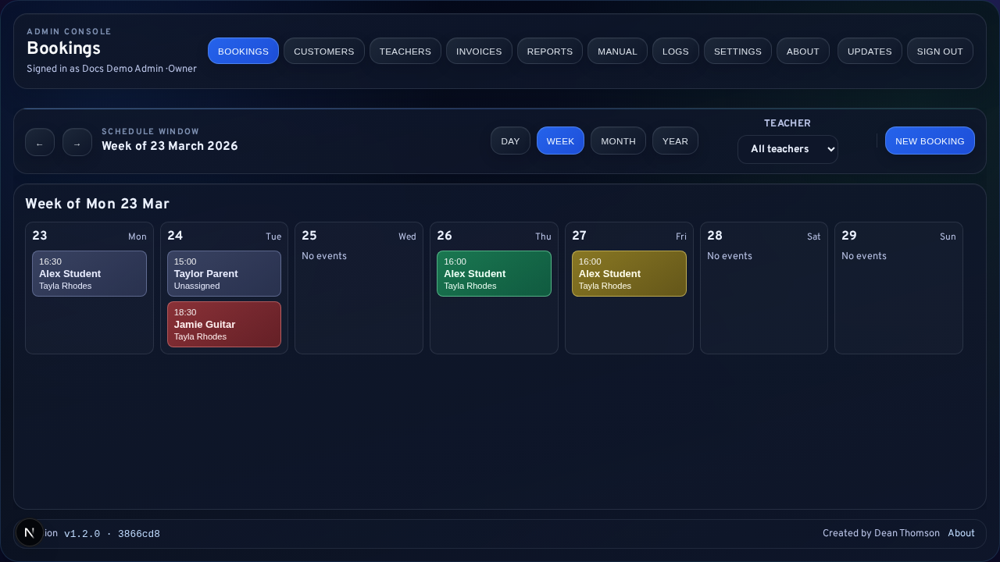
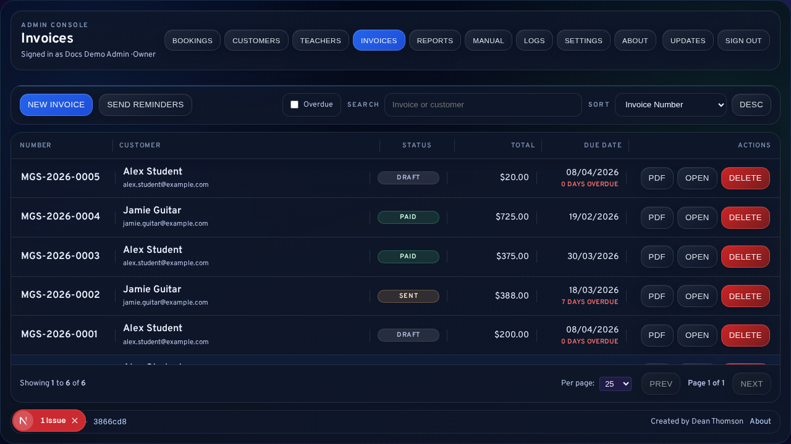
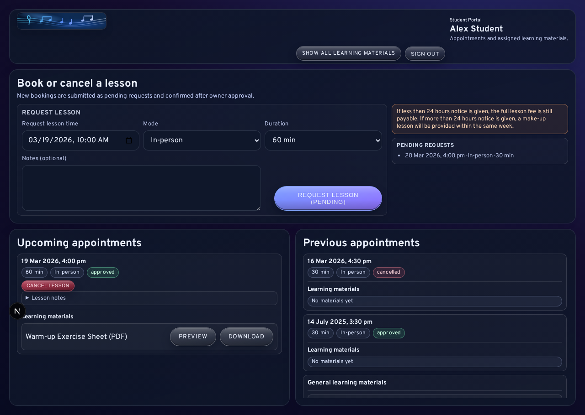
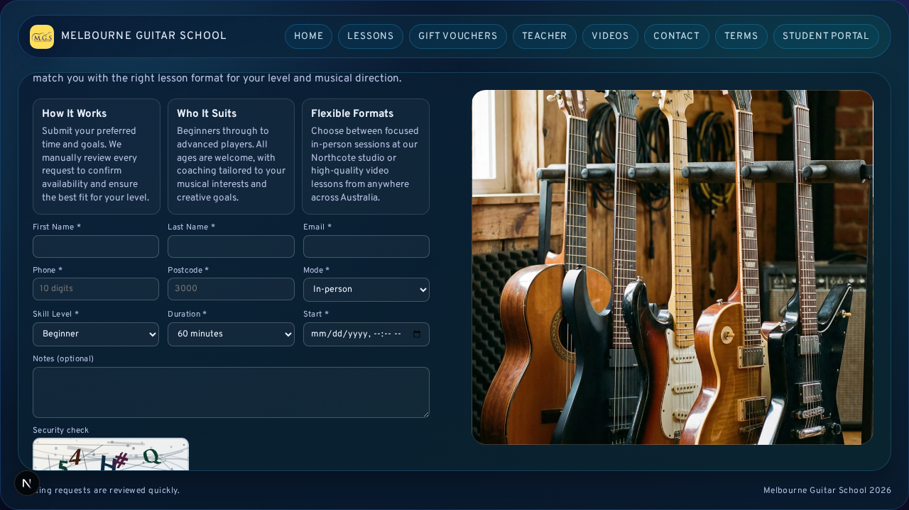

# LessonFlow

<p align="center">
  
</p>

LessonFlow is a self-hosted operations platform for music teachers and studios. It combines public lesson enquiries, scheduling, customer records, invoicing, reporting, student materials, and operator tooling in one Next.js application that can run on your own VPS.

This repository is the working codebase for the product. The root README is intended to answer four questions quickly:

- What the product does
- How to run it locally
- How production deployment works
- Where the deeper docs live

## What LessonFlow Includes

- **Public website and lead capture**: marketing pages plus booking, contact, voucher, privacy, and terms flows.
- **Protected intake workflows**: CAPTCHA, honeypot, geoblocking-aware public submissions, and admin follow-up entry points.
- **Admin operations console**: booking approvals, manual bookings, customer management, invoicing, reports, settings, logs, and operator manual access.
- **Staff and assignment management**: owner-managed teacher accounts, teaching profiles, and assignment-aware workflows.
- **Student portal**: secure login, appointment visibility, cancellation/request handling, and learning material access.
- **Operational tooling**: update visibility, screenshot-backed manual content, reporting jobs, and deployment-maintenance scripts.
- **Timezone-safe scheduling and billing**: booking and invoice flows use the configured business timezone rather than implicit browser/local machine time.

## Why Teams Evaluate It

- **Self-hosted by design**: production targets a low-power VPS using `systemd + nginx + MariaDB`, not a container runtime.
- **One operational surface**: public enquiries, admin follow-up, student access, invoicing, and reports live in the same system.
- **Documentation stays close to the product**: the repository manual and `/admin/manual` are maintained from the same source content.
- **Built for ongoing operations**: deployment scripts, update visibility, reporting, logs, and operator workflows are part of the product, not afterthoughts.

## Quick Start

Requirements:

- Node.js 20+
- Docker with Compose support for local MariaDB only

```bash
npm ci
cp .env.example .env
docker compose up -d
npm run prisma:generate
npx prisma migrate deploy
npm run dev
```

Then open:

- App: `http://localhost:3000`
- First-run setup: `http://localhost:3000/setup`
- Admin login: `http://localhost:3000/admin/login`
- Student login: `http://localhost:3000/student/login`

Notes:

- Local development uses Docker Compose for MariaDB.
- Production deployment does **not** use Docker; see the VPS deployment guide below.
- For seeded local workflows, troubleshooting, and the full day-to-day setup guide, use [`LOCAL-DEVELOPMENT.md`](LOCAL-DEVELOPMENT.md).

## Ephemeral Demo Preview

For a reset-on-exit local instance suitable for walkthroughs or sales demos:

```bash
./scripts/test-full-site-demo.sh
```

The demo flow seeds a richer dataset, prints preview links plus demo credentials, allows temporary edits during the session, and destroys the demo database when the session ends.

## Self-Hosting on a VPS

LessonFlow ships with deployment and maintenance tooling for Linux VPS environments.

```bash
git clone https://gitlab.com/grahfmusic/lessonflow.git
cd lessonflow
sudo ./deploy/setup-packages.sh
sudo ./deploy/deploy.sh --branch main --ssl --domain yourdomain.com
```

After deployment, set `SETUP_ACCESS_TOKEN` in the shared server environment, then finish bootstrap in the browser at:

`https://yourdomain.com/setup?setupToken=your-bootstrap-token`

Deploy model:

- `deploy/update.sh` advances the persistent source checkout with `git fetch/pull`.
- `deploy/deploy.sh` builds a timestamped release under `/var/www/lessonflow/releases/` and repoints `/var/www/lessonflow/current`.
- `sudo ./deploy/deploy.sh --print-deploy-mode` reports the current host layout.

For install, updates, rollback, SSL, timers, backups, and troubleshooting, see [`deploy/README.md`](deploy/README.md).

## Documentation Map

- Local setup and daily developer workflow: [`LOCAL-DEVELOPMENT.md`](LOCAL-DEVELOPMENT.md)
- VPS deployment and maintenance: [`deploy/README.md`](deploy/README.md)
- Operator manual index: [`Documentation/README.md`](Documentation/README.md)
- Technical owner runbook: [`Documentation/digitalocean-admin-operations.md`](Documentation/digitalocean-admin-operations.md)
- Changelog: [`CHANGELOG.md`](CHANGELOG.md)
- Release maintainer checklist: [`Documentation/release-maintainer-checklist.md`](Documentation/release-maintainer-checklist.md)

## Core Commands

```bash
# Development
npm run dev
npm run build
npm run start

# Quality
npm run lint
npm run typecheck

# Tests
npm run test
npm run test:e2e

# Docs screenshots
npm run docs:screenshots:seed
npm run docs:screenshots
npm run docs:screenshots:sync

# Prisma
npm run prisma:generate
npm run prisma:migrate
```

## Route Map

- Public: `/`, `/lessons`, `/teacher`, `/videos`, `/book`, `/contact`, `/vouchers`, `/privacy`, `/terms-of-service`
- Setup: `/setup`
- Admin: `/admin/login`, `/admin/bookings`, `/admin/customers`, `/admin/teachers`, `/admin/invoices`, `/admin/reports`, `/admin/settings`, `/admin/manual`, `/admin/system-logs`, `/admin/about`, `/admin/updates/progress`
- Student: `/student/login`, `/student/portal`, `/student/materials`

## Selected Screenshots

### Bookings Console

Operational calendar visibility, approvals, and lesson management.

### Invoices and Follow-Up

Billing status, overdue balances, and reminder workflows in one view.

### Student Portal

Students can review appointments and access assigned learning materials.

### Public Booking Flow

Public lesson enquiries feed directly into the admin workflow.

## Stack

- Next.js 15 App Router
- TypeScript 5
- MariaDB with Prisma
- Radix UI and GSAP
- Zod validation
- Vitest and Playwright

## Credits

LessonFlow was developed in `2026` and created by `Dean Thomson`.

- Contact: [contact@grahfmusic.com](mailto:contact@grahfmusic.com)
- GitLab repository: [https://gitlab.com/grahfmusic/lessonflow.git](https://gitlab.com/grahfmusic/lessonflow.git)
- GitLab wiki: [https://gitlab.com/grahfmusic/lessonflow/-/wikis/home](https://gitlab.com/grahfmusic/lessonflow/-/wikis/home)

## License

LessonFlow is released under the **MIT License**. See [`LICENSE`](LICENSE).
